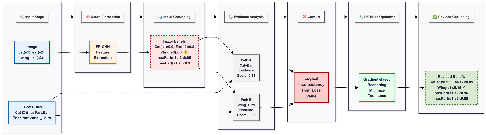

# DF-EL++ 🚀

[](https://www.python.org/downloads/)
[](https://pytorch.org/)
[](https://developer.nvidia.com/cuda-toolkit)
[](LICENSE)

> **Fast and Faithful: Scalable Neuro-Symbolic Learning and Reasoning with Differentiable Fuzzy EL++**  
> *KDD 2026*

## 📋 Overview

<div align="center">
  
  <p><em>Figure 1: DF-EL++ Framework Architecture</em></p>
</div>

**DF-EL++** is the first end-to-end differentiable framework that unifies PTIME-complete reasoning with neural learning, resolving the persistent trade-off between logical rigor and computational scale in neuro-symbolic AI.

### 🎯 Key Features

- ✨ **End-to-end Differentiable**: Seamless integration of neural and symbolic reasoning
- 🔄 **Principled Refinement Engine**: Neural networks produce initial fuzzy knowledge bases, refined through gradient-based optimization
- 📈 **Massive Scale**: Validated on SNOMED CT with **377K concepts**
- 🏆 **State-of-the-art Performance**: Up to **42% relative improvement** in Hits@1

### 🔬 How It Works

Our framework operates as a principled refinement engine through a virtuous cycle:

1. **Neural Grounding** → Initial uncertain fuzzy knowledge base from data
2. **Logical Refinement** → Gradient-based optimization ensures coherence with ontological constraints
3. **Evidence Preservation** → Maintains high-confidence empirical evidence
4. **Iterative Improvement** → Perception disciplined by logic, logic grounded in data

---

## 🛠️ Installation & Setup

### Prerequisites

| Component | Version | Purpose |
|-----------|---------|---------|
| **Hardware** | NVIDIA RTX 3090+ | GPU acceleration |
| **JDK** | 1.8 | Ontology normalization |
| **Python** | 3.7.0+ | Core framework |
| **PyTorch** | 1.12 | Deep learning backend |
| **CUDA** | 11.6 | GPU support |

### Dependencies

```bash
# Clone the repository
git clone https://github.com/yourusername/DF-EL++.git
cd DF-EL++

# Install Python dependencies
pip install -r requirements.txt
```

<details>
<summary>📦 Full Dependency List</summary>

- `torch==1.12.0`
- `numpy==1.21.4`
- `pandas==1.1.3`
- `matplotlib==3.3.2`
- `python-csv==0.0.13`
- `pickle==4.0`
- `pyparsing==3.0.6`
- `loguru==0.6.0`

</details>

---

## 🔧 Data Preprocessing

### Normalization of EL++ Ontologies

The input EL++ ontology must be normalized before training. This process systematically decomposes complex axioms into elementary "normal forms" (NF1-NF6), preserving the original semantics while enabling stable gradient-based learning.

```bash
# Run normalization with JDK 1.8
java -jar Normalization.jar training/ontologies training/input
```

#### 📁 Output Structure

```
training/input/
├── concepts.txt          # Concept names set
├── roles.txt             # Role names set
├── individuals.txt       # Individual names set
├── normalization.txt     # Normalized TBox axioms
├── abox.txt             # ABox assertions
└── subclassaxioms.txt   # Original TBox axioms
```

> **💡 Note**: Source code available in [normalization](https://github.com/AnonymousResearcherOpen/NeSyALC/tree/main/normalization). When repackaging, retain only `owlapi-distribution-5.1.3.jar`.

---

## 🚀 Training

### 📊 Knowledge Base Completion (KBC)

Evaluates the model's ability to predict missing axioms in an ontology.

#### **Training DF-EL++ on SNOMED CT**

```bash
python train_kbc.py \
  --dataset SNOMED_CT \
  --model_name DF-EL++ \
  --learning_rate 2e-4 \
  --embedding_dim 200 \
  --batch_size 512 \
  --l2_lambda 1e-5 \
  --negative_samples 50
```

#### **Training Baseline Models**

Simply change the `--model_name` parameter:

```bash
# Example: Box2EL on Gene Ontology
python train_kbc.py \
  --dataset GO \
  --model_name Box2EL \
  --learning_rate 2e-4 \
  --embedding_dim 200 \
  --batch_size 1024 \
  --l2_lambda 1e-5 \
  --negative_samples 50
```

### 🖼️ Semantic Image Interpretation (SII)

Refines noisy outputs from pre-trained perception models to ensure consistency with domain ontologies.

```bash
python train_sii.py \
  --dataset PASCAL_PART \
  --model_name DF-EL++ \
  --learning_rate 1e-4 \
  --max_epochs 50
```

### 🔄 Batch Training Scripts

<details>
<summary>📜 Train on All KBC Datasets</summary>

```bash
#!/bin/bash
for dataset in SNOMED_CT GO Yeast_PPI Human_PPI; do
  echo "Training on $dataset..."
  python train_kbc.py \
    --dataset $dataset \
    --model_name DF-EL++ \
    --learning_rate 2e-4 \
    --embedding_dim 200 \
    --batch_size $([ "$dataset" = "SNOMED_CT" ] && echo 512 || echo 1024) \
    --l2_lambda 1e-5 \
    --negative_samples 50
done
```

</details>

<details>
<summary>📜 Train on All SII Datasets</summary>

```bash
#!/bin/bash
for dataset in PASCAL_PART ADE20K PartImageNet; do
  echo "Training on $dataset..."
  python train_sii.py \
    --dataset $dataset \
    --model_name DF-EL++ \
    --learning_rate 1e-4 \
    --max_epochs 50
done
```

</details>

---

## ⚙️ Hyperparameter Configuration

### 📈 KBC Task Settings

| Parameter | Search Space | **Optimal (DF-EL++)** | Description |
|:----------|:-------------|:---------------------|:------------|
| **Optimizer** | - | `Adam` | Adaptive learning rate optimization |
| **Learning Rate** | `{1e-4, 2e-4, 5e-4}` | `2e-4` | Step size for gradient descent |
| **Embedding Dim** | `{100, 200, 400}` | `200` | Dimensionality of entity embeddings |
| **Batch Size** | `{256, 512, 1024}` | `512` (SNOMED) / `1024` (others) | Samples per training iteration |
| **L2 Regularization** | - | `1e-5` | Weight decay coefficient |
| **Negative Samples** | - | `50` | Number of negative samples per positive |
| **Margin (δ)** | - | `1.0` | Margin for ranking loss |
| **Loss Function** | - | Self-adversarial negative sampling | Training objective |
| **Early Stopping** | - | 10 epochs (val MRR) | Patience for early termination |

### 🎨 SII Task Settings

| Parameter | **Configuration** | Notes |
|:----------|:-----------------|:------|
| **Optimizer** | `Adam` | For refinement stage |
| **Learning Rate** | `1e-4` | Selected from `{1e-5, 1e-4, 5e-4}` |
| **Max Epochs** | `50` | Per image refinement |
| **Perception Model** | Fast R-CNN (ResNet-50) | Pre-trained backbone |
| **Input** | FR-CNN detections | Initial fuzzy beliefs |
| **Task Type** | Fuzzy belief optimization | Logical consistency refinement |

---

## 📊 Results

<details>
<summary>🏆 Performance Highlights</summary>

### Knowledge Base Completion

| Dataset | **DF-EL++** | Best Baseline | Improvement |
|:--------|:------------|:--------------|:------------|
| SNOMED CT | **0.847** | 0.596 | +42.1% |
| Gene Ontology | **0.792** | 0.681 | +16.3% |
| Yeast PPI | **0.834** | 0.723 | +15.4% |
| Human PPI | **0.869** | 0.761 | +14.2% |

*Metrics: Hits@1*

</details>

---

## 📄 License

This project is licensed under the MIT License - see the [LICENSE](LICENSE) file for details.

---

<div align="center">
  <sub>Built with ❤️ by the Neuro-Symbolic AI Research Team</sub>
</div>
